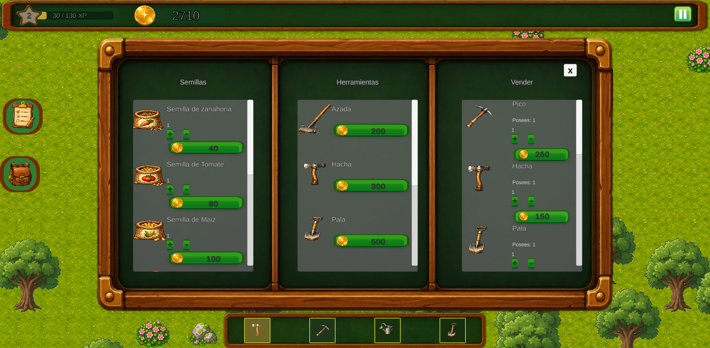
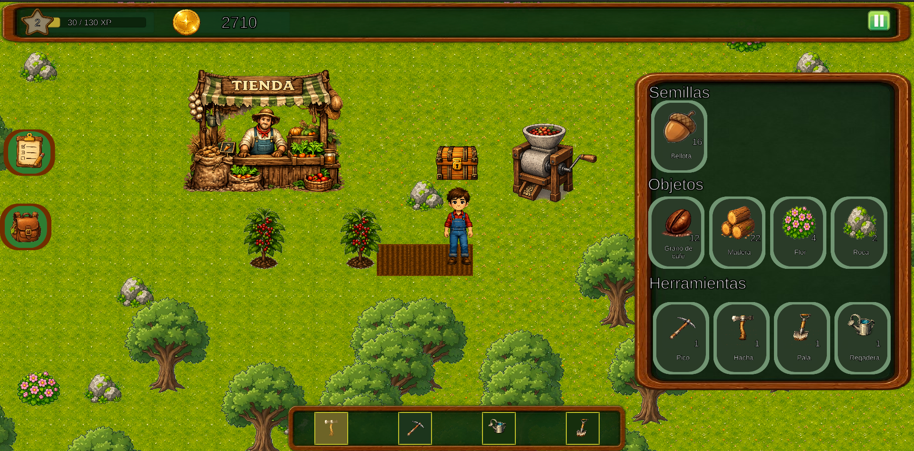
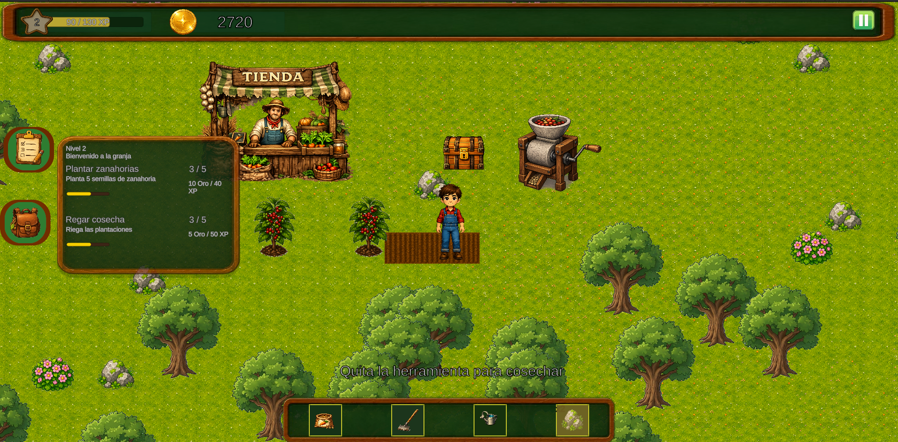

# AGROPILOT

### Aprende sobre el campo jugando

Agropilot es un juego educativo de simulacion agricola que te permite aprender sobre agricultura, ganaderia y sostenibilidad de una manera divertida e interactiva.

---

## Descripcion

Agropilot es un simulador educativo donde los jugadores pueden explorar el mundo agricola, conocer practicas sostenibles y descubrir como se cultivan los alimentos que consumimos diariamente. A traves de diferentes misiones y actividades, el jugador adquiere conocimientos reales sobre el campo mientras se divierte.

## Caracteristicas

- **Simulacion Realista** - Experimenta la agricultura con mecanicas reales de cultivo, riego y cosecha.
- **Mundo Abierto** - Explora extensos campos, valles y granjas en un mundo completamente abierto.
- **Pesca** - Relajate pescando en el lago y encuentra peces unicos.
- **Economia** - Vende tus cultivos, compra herramientas y semillas.
- **NPC con IA** - Interactua con Fermin, un NPC integrado con inteligencia artificial que te ensena sobre agricultura.

## Capturas

| Tienda | Inventario | Misiones |
|--------|------------|----------|
|  |  |  |

## Tecnologias

- React 19
- React Router
- C# Y unity 2d
- GitHub Pages (despliegue)
- Dialogflow (chatbot)
- Railway (backend)

## Autores

- **Niray Yussifh Munoz Amador**
- **Juan David Laguna Bayona**

## Licencia

Proyecto educativo - Todos los derechos reservados.

---

Link: https://juanlagunab.github.io/Agropilot/
